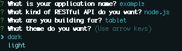
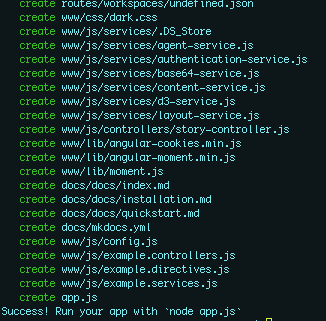

First make sure you've installed all dependencies and installed the generators by following the [installation](installation "Installation").

# Generate a web app
```
cd [working directory]
mkdir [appFolder]
cd [appFolder]
yo
```

## Prompts
Yeoman will walk you through each in the CLI.


* **Application name**: Expects a string with no spaces
* **RESTful API**: Expects a list selection; options are node (javascript) or web.py (python)
* **Build agent**: Expects a list selection; options are desktop or tablet
* **Theme**: Expects a list selection; options are light or dark

## Build complete
You should see a long list of files created with a final success message.


# Serve app

If you built a node.js API simply type into the CLI
`node app.js`

If you built a web.py API simply type into the CLI
`python app.py`

Whether you chose a node or webpy RESTful API your front-end files will be available at `127.0.0.1:8000` and your API will be available at `127.0.0.1:8000/api/..`.

For example a default endpoint of `127.0.0.1:8000/api/data/app` should resolve with metadata about the application.