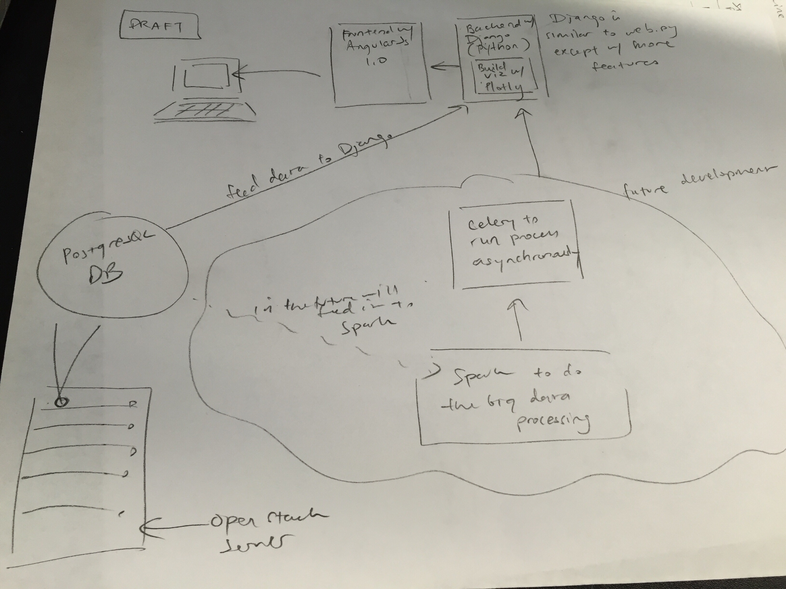

We are in the process of revising the desktop prototype. This development is 
currently being implemented in a separate [repo](https://github.com/tiffanyj41/adp).
It will be integrated to the Gestalt repo after its completion.

The future build will utilize Angular 1.0 as the frontend and Django as the backend. 
The reason why we decided to pursue Django and forego webpy is because Django has
more features than webpy's.

Since we are going to ingest large numbers of data, processing these data will 
consume a lot of time. For this reason, we need additional backend besides Django to 
run our tasks asynchronously because Django cannot run very long processes.

Our hope is that we can integrate Celery with Django since Celery is meant to handle
asynchronous tasks. We will then connect Celery to Spark to process the big data.
The data will then be fed from PostgreSQL database. This database will still reside
in the OpenStack Server.


