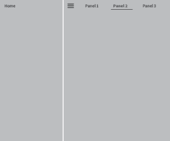
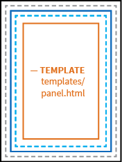
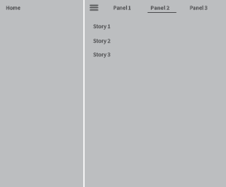
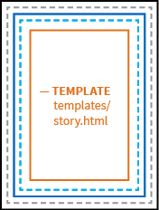
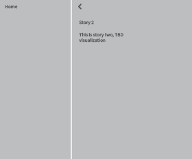

# Web App Structure

Because we use Angular 1.0 and there are many different ways to implement the framework, the following is an attempt to make our engineering of the prototype transparent. We are trying to follow [these standards](https://github.com/johnpapa/angular-styleguide/blob/master/a1/README.md "John Papa's Angular 1 Style Guide"). The main concept is the idea of single responsibility (1 component per file and ideally less than 400 lines of code). In practice, this means a lot of files and a lot of linkages between files. The following maps out our implementation to aid in modification.


## Angular MVC
The documentation follows the order of __View -> Controller -> Model__ because that seems the most intuitive to understand the structure.

* __View__ - Users interact with the view (HTML/CSS)
* __Controller__ - Controllers perform changes on the model (JavaScript)
* __Model__ - Data


## Angular UI-Router
Routing in this implementation of Angular/Ionic uses [UI-Router](http://angular-ui.github.io/ui-router/site/#/api/ui.router "UI-Router") so some of the specific template reference relationships are unique to this spec. All states are configured in `js/app.js`.

---

## App Entry Point
| UI-Router state | Angular View | Angular Controller | Angular Model |
| --- |---| --- | --- |
| decides which state loads based on URL match | decides which HTML file is displayed | decides which JavsScript file controls the view | decides how data is structured for the view |
| menu | index.html | none | none |

### State: menu
```javascript
.state("menu", {
    url: "/",
    abstract: true,
    template: "<ion-nav-view name='menu'></ion-nav-view>"
});
```

The reason this prototype is set up with the menu state as the highest-level state and as an abstract state is due to the specific implementation of the Ionic Framework when working with their menu directives. It is also the reason why two ion-nav-views are nested inside each other.

### Template: index.html
```html
<!-- ONLY RELEVANT CODE SHOWN -->
<body>

    <!-- renders app view -->
    <ion-nav-view></ion-nav-view>
    
</body>
```

| Abstract Illustration | Implementation Example |
| --- | --- |
|  |  |

### Controller: none
There is no overarching controller for this view because at this point we do not need one but you can easily add one should your use case require it. If one existed, it would be declared inside the state object.

### Model: none
There is no overarching model for this view because currently no data needs to be accessed by the user at this level of the app.

---

## Menu
| UI-Router state | Angular View | Angular Controller | Angular Model |
| --- |---| --- | --- |
| decides which state loads based on URL match | decides which HTML file is displayed | decides which JavsScript file controls the view | decides how data is structured for the view |
| app | app.html | app-controller.js | `/* Layout */ api/workspaces/<username>` `/* Content */ api/data/TBD` |

### State: menu
```javascript
.state("app", {
    url: "/{workspace}",
    abstract: true,
    templateUrl: "templates/app.html",
    controller: "appCtrl"
});
```

### Template: app.html
```html
<!-- ONLY RELEVANT CODE SHOWN -->
<!-- FROM INDEX.HTML -->
<body>

    <ion-nav-view>
    
        <!-- FROM MENU STATE TEMPLATE -->
        <ion-nav-view name="menu">
        
            <!-- FROM APP.HTML -->
            <!-- renders center menu from Ionic Framework -->
            <ion-side-menu-content>
            
                <!-- renders panel navigation -->
                <div></div>
            
                <!-- renders panel view -->
                <ion-nav-view name="panel"></ion-nav-view>
                
            </ion-side-menu-content>
            
            <!-- renders left menu from Ionic Framework -->
            <ion-side-menu side="left"></ion-side-menu>
            
        </ion-nav-view>
    
    </ion-nav-view>
    
</body>
```

The app is set up in a series of panels which are the highest-level organization of information. Panels usually simply organize smaller bits of content into a organized group.

| Abstract Illustration | Implementation Example |
| --- | --- |
|  |  |

### Controller: appCtrl
```JavaScript
// ONLY RELEVANT CODE SHOWN
// get LAYOUT data stored in service	
layoutService.getPanels($rootScope.globals.currentUser.username).then(function(data) {

    // set scope
    $scope.panels = data;

});
```
Notice that there is no specific `contentService` API call for this state. This is because at this point there is no panel-specific content needing to be rendered into the app and often there will never be an API call for content at this level.

### Model:

__Layout__
`api/workspaces/<username>`

```JavaScript
// truncated for legibility
[
    {
        "_id": "1",
        "title": "Panel 1",
        "description": "",
        "url": {
            "param": "navitem1"
        }
    },
    {
        "_id": "2",
        "title": "Panel 2",
        "description": "",
        "url": {
            "param": "navitem2"
        }
    },
	{
        "_id": "3",
        "title": "Panel 3",
        "description": "",
        "url": {
            "param": "navitem3"
        }
    },
    ...
]
```

Username is an optional parameter. For our purposes we may want to experiement with different layouts/data scopes for specific users and thus need a model for that specificity.

__Content__
`api/data/TBD`

Content may or may not make sense at a panel level inside this application. For now it is TBD and not coded in the controller to request any content for the panels.

---

## Panel
| UI-Router state | Angular View | Angular Controller | Angular Model |
| --- |---| --- | --- |
| decides which state loads based on URL match | decides which HTML file is displayed | decides which JavsScript file controls the view | decides how data is structured for the view |
| panel | panel.html | panel-controller.js | `/* Layout */ api/workspaces/<username>` `/* Content */ api/data/<panelParam>` |

### State: panel
```javascript
.state("app.panel", {
    url: "/{panel}",
    views: {
        "panel": { // note this key must match the "name" in the HTML parent template
            templateUrl: "templates/panel.html",
            controller: "panelCtrl"
        }
    }
});
```
### Template: panel.html
```html
<!-- ONLY RELEVANT CODE SHOWN -->
<!-- FROM INDEX.HTML -->
<body>

    <ion-nav-view>
    
        <!-- FROM MENU STATE TEMPLATE -->
        <ion-nav-view name="menu">
        
            <!-- FROM APP.HTML -->
            <!-- renders center menu from Ionic Framework -->
            <ion-side-menu-content>
            
                <!-- renders panel navigation -->
                <div></div>
            
                <!-- renders panel view -->
                <ion-nav-view name="panel">
                
                    <!-- FROM PANEL.HTML -->
                    <!-- renders panel content -->
                    <ion-view></ion-view>
                    
                </ion-nav-view>
                
            </ion-side-menu-content>
            
            <!-- renders left menu from Ionic Framework -->
            <ion-side-menu side="left"></ion-side-menu>
            
        </ion-nav-view>
    
    </ion-nav-view>
    
</body>
```

Each panel is set up as a series of stories. We may not need this level of abstraction but it allows us to group stories in logical collections like possibly "contagion stories", "gdp stories", etc.

| Abstract Illustration | Implementation Example |
| --- | --- |
|  |  |

### Controller: panelCtrl
```JavaScript
// ONLY RELEVANT CODE SHOWN
// get LAYOUT data stored in service	
layoutService.getPanel(panel).then(function(data) {
		
    // set scope
    $scope.panel = data;

});

// get CONTENT data stored in service
contentService.getData(panel).then(function(data) {
		
    // set scope
    $scope.content = data.length > 0 ? data : [{ title: "Nothing Found.", content: "Sorry but can't find any content.", poster: "None" }];

});
```

Because the panel state is dedicated to a single panel at a time both the `layoutService` and the `contentService` load a single panel's layout and content versus loading all of them for each panel.

### Model:

__Layout__
`api/workspaces/<username>`

```JavaScript
{
    "_id": "2",
    "title": "Panel 2",
    "description": "",
    "url": {
        "param": "navitem2"
    }
}
```

Username is an optional parameter. For our purposes we may want to experiement with different layouts/data scopes for specific users and thus need a model for that specificity. Based on the active panel the workspace will return just that single panel's layout data.

__Content__
`api/data/<panelParam>`

```JavaScript
[
	{
		"name": "story1"
	},
	{
		"name": "story2"
	},
    {
		"name": "story3"
	}
]
```

The `contentService` takes the panel param as returned by the `layoutService` and queries the content database for that panel's data.

---

## Story
| UI-Router state | Angular View | Angular Controller | Angular Model |
| --- |---| --- | --- |
| decides which state loads based on URL match | decides which HTML file is displayed | decides which JavsScript file controls the view | decides how data is structured for the view |
| story | story.html | story-controller.js | `/* Layout */ TBD` `/* Content */ api/data/<storyParam>` |

### State: story
```javascript
.state("app.story", {
    url: "/detail/{id}",
    views: {
        "panel": { // note this means a story loads in the panel container (and not a dedicated story container)
            templateUrl: "templates/story.html",
            controller: "storyCtrl"
        }
    }
});
```
### Template: story.html
```html
<!-- ONLY RELEVANT CODE SHOWN -->
<!-- FROM INDEX.HTML -->
<body>

    <ion-nav-view>
    
        <!-- FROM MENU STATE TEMPLATE -->
        <ion-nav-view name="menu">
        
            <!-- FROM APP.HTML -->
            <!-- renders center menu from Ionic Framework -->
            <ion-side-menu-content>
            
                <!-- renders panel navigation -->
                <div></div>
            
                <!-- renders panel view -->
                <ion-nav-view name="panel">
                
                    <!-- FROM PANEL.HTML -->
                    <!-- renders story content -->
                    <ion-view></ion-view>
                    
                </ion-nav-view>
                
            </ion-side-menu-content>
            
            <!-- renders left menu from Ionic Framework -->
            <ion-side-menu side="left"></ion-side-menu>
            
        </ion-nav-view>
    
    </ion-nav-view>
    
</body>
```

Each individual story will render in an entire panel view and not have a unique view alongside a panel view but will replace the panel of stories with the single story when the story state is activated.

| Abstract Illustration | Implementation Example |
| --- | --- |
|  |  |

### Controller: storyCtrl
```JavaScript
// ONLY RELEVANT CODE SHOWN
// get CONTENT data stored in service
contentService.getData(story).then(function(data) {

    // set scope
    $scope.content = data;

});
```
Currently all stories use the same layout, however we could implement a layout specific to each story and then would need a `layout-service`.

### Model:

__Layout__
None

__Content__
`api/data/<storyParam>`

```JavaScript
{
	"name": "story 2",
	"description": "this is story two, TBD visualization"
}
```

The `contentService` takes the story param as returned by the `layoutService` and queries the content database for that story's data.