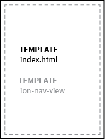
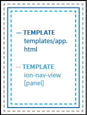

# Web App Structure

Because we use Angular 1.0 and there are many different ways to implement the framework, the following is an attempt to make our engineering of the prototype transparent. We are trying to follow [these standards](https://github.com/johnpapa/angular-styleguide/blob/master/a1/README.md "John Papa's Angular 1 Style Guide"). The main concept is the idea of single responsibility (1 component per file and ideally less than 400 lines of code). In practice, this means a lot of files and a lot of linkages between files. The following maps out our implementation to aid in modification.


## Angular MVC
The documentation follows the order of __View -> Controller -> Model__ because that seems the most intuitive to understand the structure.

* __View__ - Users interact with the view (HTML/CSS)
* __Controller__ - Controllers perform changes on the model (JavaScript)
* __Model__ - Data


## Angular UI-Router
Routing in this implementation of Angular/Ionic uses [UI-Router](http://angular-ui.github.io/ui-router/site/#/api/ui.router "UI-Router") so some of the specific template reference relationships are unique to this spec. All states are configured in `js/app.js`.

## App Entry Point
| UI-Router state | Angular View | Angular Controller | Angular Model |
| --- |---| --- | --- |
| decides which state loads based on URL match | decides which HTML file is displayed | decides which JavsScript file controls the view | decides how data is structured for the view |
| menu | index.html | none | none |

### State: menu
```javascript
.state("menu", {
    url: "/",
    abstract: true,
    template: "<ion-nav-view name='menu'></ion-nav-view>"
});
```
only relevant code shown

The reason this prototype is set up with the menu state as the highest-level state and as an abstract state is due to the specific implementation of the Ionic Framework when working with their menu directives. It is also the reason why two ion-nav-views are nested inside each other.

### Template: index.html
```html
<body>

    <!-- renders app view -->
    <ion-nav-view></ion-nav-view>
    
</body>
```
only relevant code shown



### Controller: none
There is no overarching controller for this view because at this point we do not need one but you can easily add one should your use case require it. If one existed, it would be declared inside the state object.

### Model: none
There is no overarching model for this view because currently no data needs to be accessed by the user at this level of the app.


## Layout
| UI-Router state | Angular View | Angular Controller | Angular Model |
| --- |---| --- | --- |
| decides which state loads based on URL match | decides which HTML file is displayed | decides which JavsScript file controls the view | decides how data is structured for the view |
| app | app.html | app-controller.js | `api/data/app` |

### State: menu
```javascript
.state("app", {
    url: "/{workspace}",
    abstract: true,
    templateUrl: "templates/app.html",
    controller: "appCtrl"
});
```
only relevant code shown

### Template: index.html
```html
<body>

    <!-- this will load the next nested view -->
    <ion-nav-view></ion-nav-view>
    
</body>
```
only relevant code shown


parent templates are light grey

### Controller: appCtrl
```JavaScript
// get LAYOUT data stored in service	
layoutService.getPanels($rootScope.globals.currentUser.username).then(function(data) {

    // set scope
    $scope.panels = data;

});
```
only relevant code shown

### Model: `api/data/app`