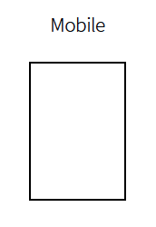
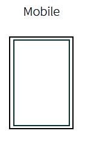
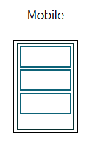

Because we use Angular 1.0, of all code written in Angular the controllers ar most closely tied to the layout implementation. The following attempts to correlate the controller to the layout implementation and make it easier for you to follow the application structure.

##app-controller##

The **app-controller** controls the highest level data like global navigation and application info, i.e. like the side menu.

##panel-controller##

The **panel-controller** controls each panel and is a child of the **app-controller**, which is the highest-level of grouping in the app. For mobile there will likely only ever be a single panel dedicated to the entire viewport but that doesn't have to be the case.

##story-controller##

The **story-controller** controls each story and is a child of the **panel-controller**. A story should be a concise collection of data with a specific scope and content which is TBD. The image simply represents several stories in a single panel; however it is possible that a story in a mobile format would take over the entire viewport.